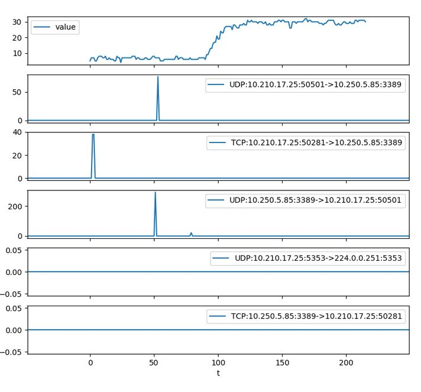
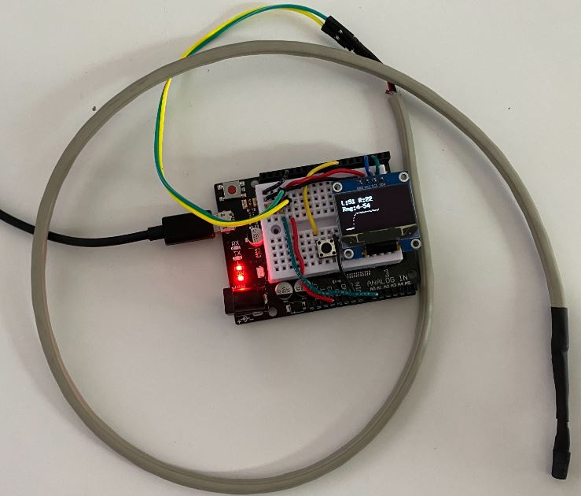
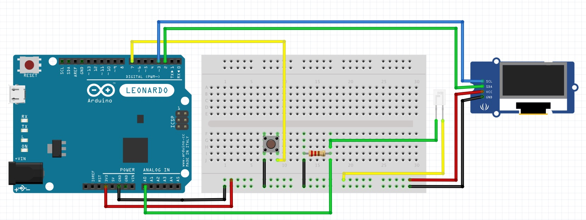

Lagmeter
--------

The hardware works by itself and measure total display lag from a simulated HID event to a dark to/from light transition on the screen.  Results are displayed on OLED screen.  The USB bus is pretty fast - events reach your app in ~1-2 ms.  The same cannot be said of all real keyboards which can add 10s of ms through a combination of slow matrix scanning/embedded CPU and slow USB bus polling speeds.

Different test modes can be selected by holding down the button to cycle through keypress (x), alt-tab, alt-esc, mouse click etc...

Optionally, you can run some software on the target machine to collect more data:
 * lagcap.py - captures packets on an interface and pulls light sensor results from arduino. Writes both into csvs in your temp dir.  Syncs clock with device
 * LagWinApp.exe - very minimal windows app that cycles from black-white-black with keypresses (x).  Also logs timestamped WM_PAINT, WM_KEYDOWN events to the tempdir
 * ProcessResults.ipynb jupyter notebook - reads in arduino output, pcap and LagWinApp output from disk and plots some results

Here's some of the charts that the notebook produces showing network traffic for an RDP test.  At the top you see the changing brightness of the screen for a letter X as read by the arduino.  Below you see the network traffic - I can only assume it is the outbound key press and display update coming back - it's all encrypted so you can't really be sure!

Getting started
---------------

1. Upload arduino sketch to your Leonardo (or clone)
1. Run lagcap.py locally in a command prompt (e.g. I use a anaconda prompt in a conda environment 
with the relevant deps - pyshark, pyserial, pandas)  Strangely, no admin prompt required despite serial and pcaps
1. Point sensor somewhere on the screen (e.g. just past the cursor on a text prompt - will depend on the selected mode)
1. Hit button
1. Results are written to tmp dir and can be viewed with the ProcessResults jupyter notebook

Building LagWinApp
------------------

If you want a really minimal baseline app you can build and run LagWinApp and use that as your test target. It will drop some timestamped window message logs in the temp dir which can be plotted against other data.

I've build this with Visual Studio 2019 - you can download the community edition for free from MS.

Python Dependencies
------------

pyshark, pyserial and pandas

Hardware
--------

Here's my meter:

And here's the wiring (I hope this is right!)  It's not exactly the same I2C SSD 1306 display I use or phototransistor part, but you get the idea. Some notes:
* Leonardo I2C pins are in a different location from other models - check the data sheets
* Make sure you connect the phototransistor the right way round!

Components:
* Arduino Leonard or clone (it's required since it can emulate a USB HID in hardware)
* SSD1306 OLED display - I bought these: https://www.amazon.co.uk/dp/B0832VQN65/ref=pe_3187911_185740111_TE_item
* SFH 3310 phototransistor https://uk.rs-online.com/web/p/phototransistors/6547808/  (I initially used an LDR but it was too slow to react and made it look like the display response time was ~50ms). It's got some heat-shrink round it here for insulation, but also to make a nice window you can point at the screen. Make sure it's wired the right way round!
* momentary microswitch - for initiating captures. Long press to change modes
* resistor 47kohm - this gives us a sensor response time of about 2ms (tested with an led driven by a square wave and an oscilloscope). A smaller resistor means that the capacitance in the sensor drains quicker and response time is faster. However the voltage change shrinks.  2ms seems fine for now, though I might be able to find a better sensor circuit.
* some wires/cable
